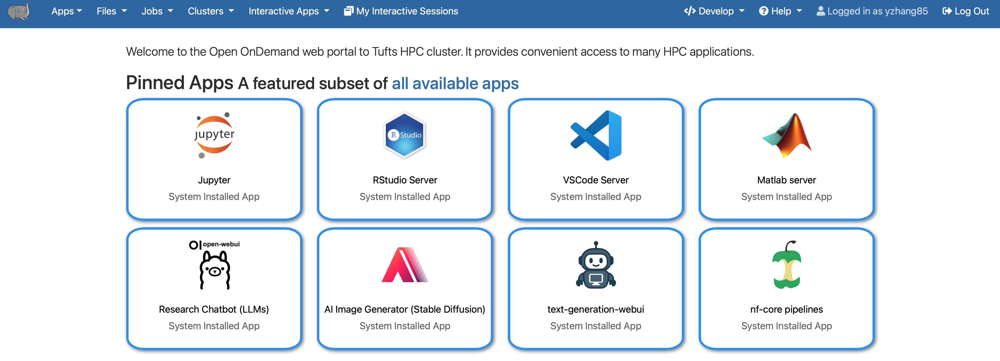
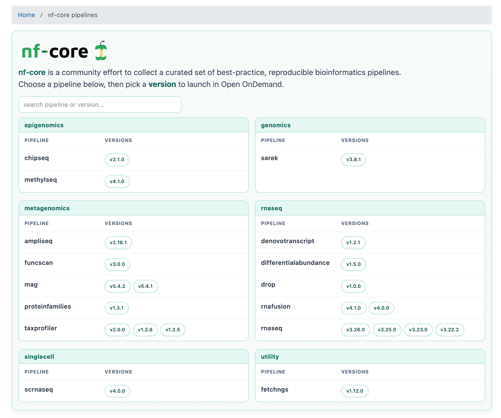

# RNA-Seq Analysis with nf-core/rnaseq

Training materials for running RNA-Seq analysis on Tufts HPC using the [nf-core/rnaseq](https://nf-co.re/rnaseq) pipeline.

## Getting Started

### Prerequisites

- A Tufts UTLN (username) and password
- VPN connection to the Tufts network (required for off-campus access)

### Log in to Tufts Open OnDemand

Navigate to the Open OnDemand portal: https://ondemand-prod.pax.tufts.edu

After logging in with your Tufts credentials, you will see the OnDemand dashboard.

From the dashboard, choose **nf-core pipelines**, then select the version of the rnaseq pipeline you'd like to run. Generally speaking, the latest version is recommended.

### Pipeline Arguments

Fill in the following arguments on the Open OnDemand submission form:

#### Cluster Settings

| Parameter                               | Value                                          | Description                                    |
| --------------------------------------- | ---------------------------------------------- | ---------------------------------------------- |
| Number of hours                         | `24`                                           | Maximum wall time for the job                  |
| Which Nextflow executor should be used? | `slurm`                                        | Tasks will be submitted as separate slurm jobs |
| Working directory                       | `/cluster/tufts/iyerlab/$USER/rnaseq_workshop` | Directory where the pipeline runs              |

#### Input/output options

| Parameter     | Value             | Description                                            |
| ------------- | ----------------- | ------------------------------------------------------ |
| input         | `samplesheet.csv` | Sample sheet listing FASTQ files and conditions        |
| outdir        | `output`          | Where results will be written, you can use other names |
| multiqc_title | `PRJNA638768`     | Title shown in the MultiQC report                      |

#### Reference Genome Options

> Pre-built references and indices for human are available on the cluster so you don't need to download or build them yourself.

| Parameter                | Value                                                                                                         | Description                                             |
| ------------------------ | ------------------------------------------------------------------------------------------------------------- | ------------------------------------------------------- |
| fasta                    | `/cluster/tufts/biocontainers/datasets/references/gencodes/human/GRCh38.primary_assembly.genome.fa`           | FASTA sequence of the reference genome                  |
| gtf                      | `/cluster/tufts/biocontainers/datasets/references/gencodes/human/gencode.v49.primary_assembly.annotation.gtf` | Gene annotation file in GTF format                      |
| star_index               | `/cluster/tufts/biocontainers/datasets/references/gencodes/human/index/star`                                  | Pre-built STAR index                                    |
| salmon_index             | `/cluster/tufts/biocontainers/datasets/references/gencodes/human/index/salmon`                                | Pre-built Salmon index                                  |
| gencode                  | `true`                                                                                                        | Use GENCODE gene annotation format                      |
| gtf_group_features       | `gene_id`                                                                                                     | Group features by gene_id for gene-level quantification |
| featurecounts_group_type | `gene_biotype`                                                                                                | Group type attribute for featureCounts                  |

#### Alignment options

| Parameter | Value         | Description                                          |
| --------- | ------------- | ---------------------------------------------------- |
| aligner   | `star_salmon` | Use STAR for alignment and Salmon for quantification |

#### Quality Control

| Parameter             | Value                                                                 | Description                                       |
| --------------------- | --------------------------------------------------------------------- | ------------------------------------------------- |
| contaminant_screening | `kraken2`                                                             | Screen for contaminants using Kraken2             |
| kraken2_db            | `/cluster/tufts/biocontainers/datasets/kraken2/k2_standard_20260226/` | Kraken2 database to use for contaminant screening |

### Submitting Your Job

After filling in the form, click the **Submit** button at the bottom of the page. This will submit your job to the Slurm scheduler on the Tufts HPC cluster.

### Monitoring Your Job

From **My Interactive Sessions** in the Open OnDemand dashboard, you can monitor the status of your job. Click the link next to **Session ID** to find the `output.log` file, which contains the Nextflow execution logs.

### Resuming a Failed Job

If your job fails for any reason, you can resume it without losing progress. Check **Resume previous run** at the bottom of the submission form. This will allow you to select the previous run and resume from where it left off.
